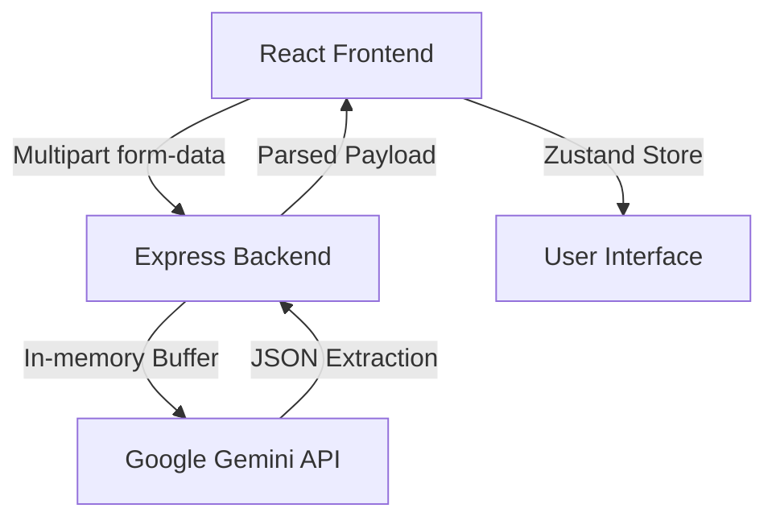

# Project Progress Report — Smart NID Nepal (Sajilo NID)

> **Last Updated:** July 2026  
> **Status:** Phase 1 Completed (Project Scaffold + Citizenship OCR)

This document serves as a persistent record of the progress made on the Smart NID Nepal application. It tracks implemented features, architectural decisions, and outlines the next phases of development.

## 1. What Has Been Done Till Now (Phase 1)

### 1.1 Backend & AI Infrastructure
- **Express Server Setup**: Initialized an Express + TypeScript server in the `server/` directory with proper error handling and environment configuration.
- **Gemini Vision Integration**: Implemented OCR extraction logic using `gemini-2.5-flash` model (`server/src/ai/extractCitizenship.ts`).
- **Prompt Engineering**: Designed a highly specific, robust prompt (`server/src/prompts/extractCitizenship.ts`) that accurately extracts bilingual fields (Nepali Devanagari and English) and handles date conversions (BS to AD).
- **Upload Route**: Created a secure, memory-based file upload endpoint (`POST /api/extract`) utilizing `multer` so that sensitive citizenship card images are processed entirely in memory and are never persisted to disk.

### 1.2 Frontend & UI (Premium Design)
- **React + Vite Setup**: Initialized the React frontend in the `client/` directory with Vite, TypeScript, and Tailwind CSS v4.
- **Zustand State Management**: Implemented a global store (`client/src/store/enrollmentStore.ts`) to manage the multi-step enrollment flow, handling image uploads, AI processing states, and extraction results.
- **DropZone Component**: Built an interactive drag-and-drop file upload component (`client/src/components/DropZone.tsx`) with clear user feedback and smooth micro-animations.
- **JsonViewer Component**: Created a beautifully styled, color-coded JSON viewer (`client/src/components/JsonViewer.tsx`) that visually displays the extracted AI data with confidence scores and interactive copy-to-clipboard functionality.
- **Upload Page Layout**: Assembled the main `UploadPage` layout to guide users intuitively through the first step of the NID enrollment process.
- **Aesthetic Refinements**: Applied a modern, premium "Light Mode" design system featuring soft shadows, clean typography, dynamic hover states, and professional static assets (e.g., hero image).

## 2. System Architecture at a Glance

## 3. Key Design Decisions
- **Privacy-First Processing**: No image files are saved to the server's local storage. `multer` processes the image in memory and passes the buffer directly to the Gemini API, maximizing user data security.
- **Tailwind CSS Customization**: Instead of relying heavily on default utility classes, custom premium styling (glassmorphism, subtle gradients, rich shadows) was prioritized in the global CSS to make the application feel trustworthy and official.
- **Strict TypeScript Typing**: Shared types between the frontend and backend ensure that the JSON payload structure from the AI strictly aligns with what the UI expects, preventing runtime errors.

## 4. Pending Tasks / Next Steps (Phase 2 & Beyond)

1. **Phase 2 — Multi-tab Enrollment Form**:
   - Transition from the `JsonViewer` into an actual form wizard where extracted data is pre-filled into editable fields (Personal Details, Address, Family, etc.).
2. **Phase 3 — AI Review Gate**:
   - Add a step where the system highlights fields with low confidence scores (returned by the Gemini API) for the user to manually verify and correct.
3. **Phase 4 — Appointment Suggestion**:
   - Suggest potential District Administration Office (DAO) appointment dates based on the user's parsed address.
4. **Phase 5 — Submission & Polish**:
   - Finalize the visual flow and compile the data into a final submittable JSON payload.
